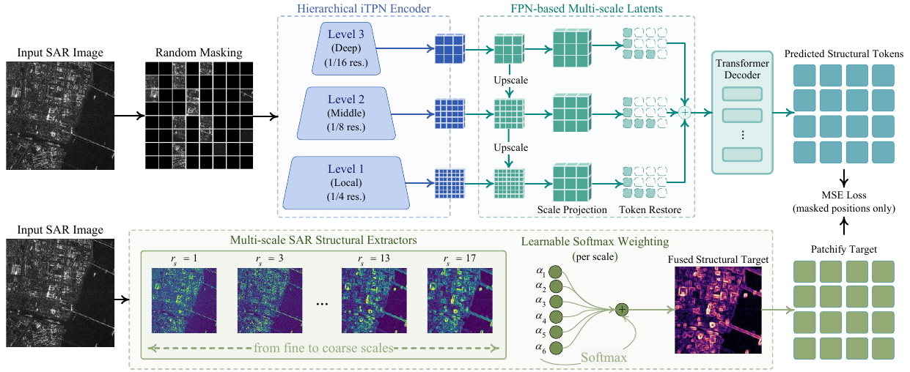
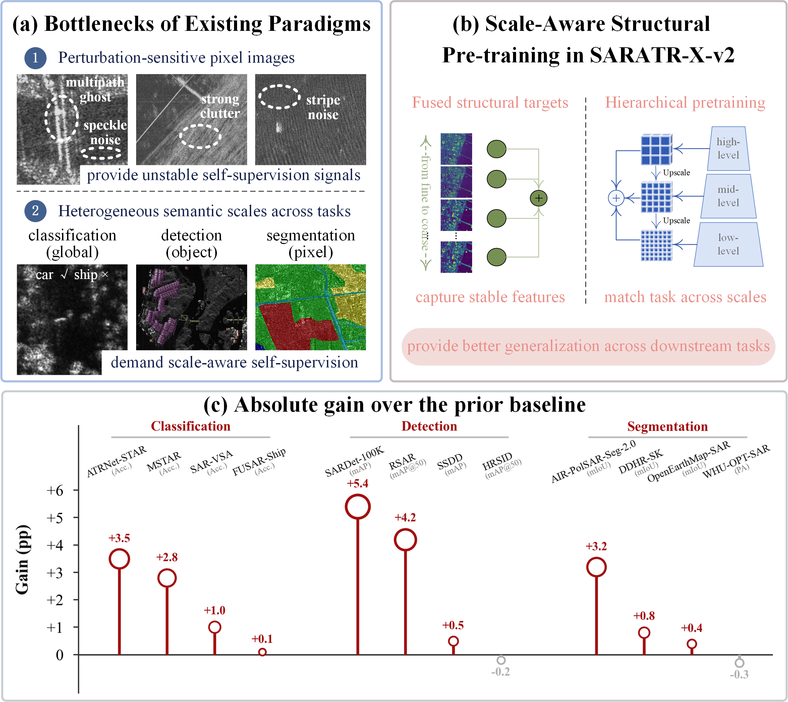
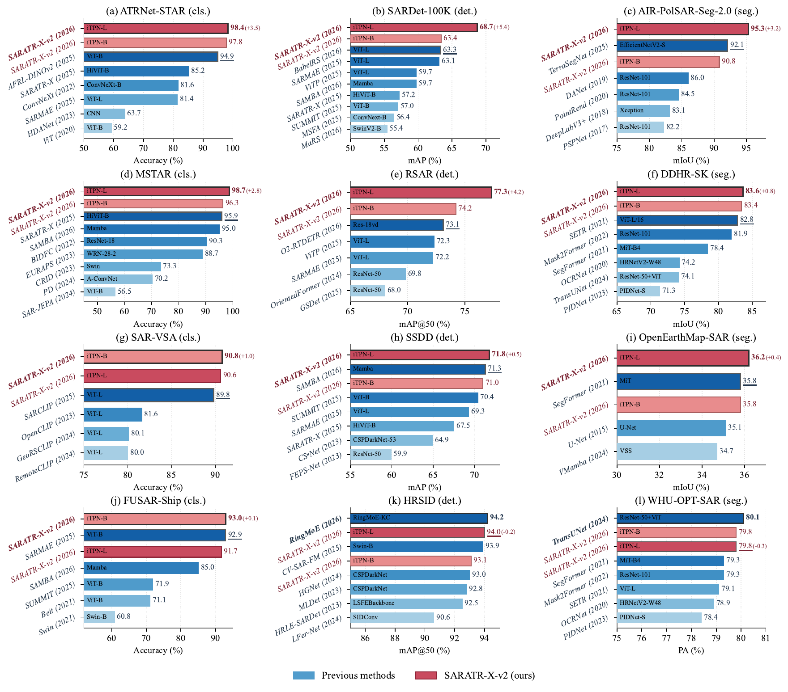
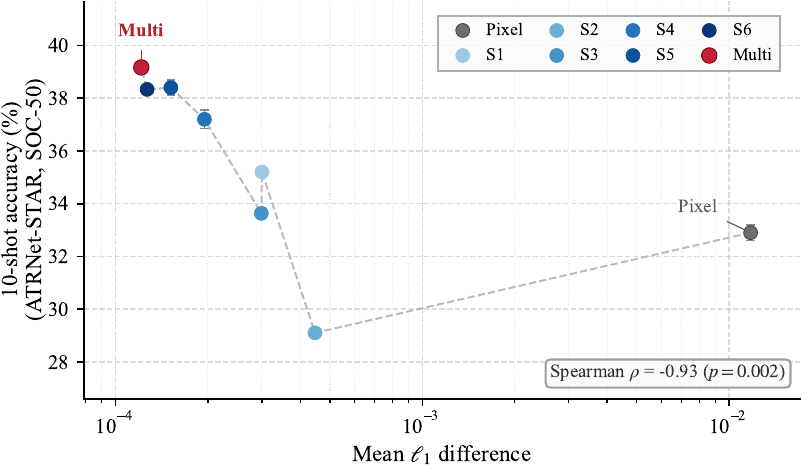

<div align="center">

# SARATR-X-v2: Scale-Aware Structural Pre-Training for SAR Foundation Models

<h5 align="center"><em> Weijie Li (李玮杰), Yafei Song (宋娅菲), Yongxiang Liu (刘永祥), Bowen Peng (彭渤文), Jie Zhou (周洁), Jingyuan Xia (夏靖远), Wei Yang (杨威), Tianpeng Liu (刘天鹏), Zhen Liu (刘振), and Li Liu (刘丽) </em></h5>

<p align="center">
  <a href="#Introduction">📖 Introduction</a> |
  <a href="#Pre-training">⚙️ Pre-training</a> |
  <a href="#Classification">📊 Classification</a> |
  <a href="#Detection">🎯 Detection</a> |
  <a href="#Segmentation">🧩 Segmentation</a> |
  <a href="#Statement">📜 Statement</a>
</p>

<p align="center">
  <a href="https://arxiv.org/abs/2607.23238"></a>
  <a href="https://github.com/waterdisappear/SARATR-X-v2"></a>
  <a href="https://github.com/waterdisappear/SARATR-X-v2/releases"></a>
</p>

<p align="center">
  
</p>

<div align="center"><b>Fig. 1 | Overall framework of SARATR-X-v2 with scale-aware structural pre-training.</b> Bottom: fixed multi-scale structural extractors spanning six receptive fields produce scale-specific responses, fused by learnable cross-scale weights into one target *y*, each operator robust to multiplicative speckle. Top: hierarchical encoder extracts multi-scale latent features from the masked input, and a decoder reconstructs *y* under an L2 loss — *design the target to carry the physics*.

<b>图 1 | SARATR-X-v2 尺度感知结构预训练总体框架。</b> 下半部分：覆盖六个感受野的固定多尺度结构算子产生各尺度响应，经可学习跨尺度权重融合为统一目标 *y*，每个算子对乘性斑点稳健；上半部分：层次编码器从掩码输入提取多尺度潜在特征，解码器在 L2 损失下重建 *y* —— “让目标承载物理”。</div>

</div>

## Introduction / 简介

**EN** — SARATR-X-v2 is a vision foundation model for SAR target recognition, built upon **scale-aware structural masked pre-training**. Its core idea is a reconstruction target that is **robust to speckle noise** and **semantically consistent across scales**, enabling state-of-the-art transfer performance on classification, detection, and segmentation.

**中文** — SARATR-X-v2 是一个面向 SAR 目标识别的视觉基础模型，采用 **尺度感知结构掩码预训练（Scale-aware Structural Masked Pre-training）**。其核心是一套对 **相干斑噪声（speckle）稳健**、且跨尺度语义一致的重建目标，通过统一的预训练在分类、检测、分割三类下游任务上取得全面领先。

This repository provides a clean, well-commented, and executable implementation of *SARATR-X-v2*, including pre-training, linear / few-shot classification, rotated object detection, semantic segmentation, and paper-figure visualization.

本仓库提供 *SARATR-X-v2* 的清晰、易读、可执行的官方实现，涵盖预训练、线性 / 少样本分类、旋转目标检测、语义分割以及论文图表复现可视化。

<p align="center">
  
</p>

<div align="center"><b>Fig. 2 | Perturbation-sensitive supervision and task-scale mismatch limit SAR pre-training.</b> (a) SAR-specific speckle perturbations destabilize pixel-space supervision, while downstream tasks require representations at different scales; (b) our method constructs a fine-to-coarse structural target and performs hierarchical pre-training, yielding perturbation-stable and scale-compatible representations; (c) the resulting representations achieve leading transfer performance across twelve downstream benchmarks.

<b>图 2 | 扰动敏感监督与任务尺度错配制约 SAR 预训练。</b> (a) SAR 特有的斑点扰动使像素空间监督不稳定，而下游任务需要不同尺度的表示；(b) 本方法构造由细到粗的结构目标并进行层次化预训练，得到扰动稳定、尺度兼容的表示；(c) 所得表示在 12 个下游基准上取得领先的迁移性能。</div>

## Highlights / 方法亮点

- **Multi-scale structural target / 多尺度结构目标**：reconstruct a physical-prior target rather than raw pixels; 以 SAR 物理先验构造重建目标，而非直接重建像素。
  - Finest scale `S1` / 最细尺度 `S1`：**blind-spot averaging / 盲点平均**，3×3 kernel with zero center weight, insensitive to speckle; 3×3 核中心权重为 0，对斑点不敏感。
  - Larger scales `S2`–`S6` / 更大尺度 `S2`–`S6`：**log-ratio directional contrast / 对数比方向对比**，disjoint half-region kernels separate structure from speckle; 相邻半区互斥核分离结构与斑点。
- **Learnable cross-scale fusion / 可学习跨尺度融合**：softmax-constrained weights fuse multi-scale structural responses into a single scale-aware target; softmax 约束的融合权重将多尺度结构响应合成为单一尺度感知目标。
- **Speckle robustness / 斑点稳健性**：`S_multi < S_k < S_pixel`, the fused target is the most stable under coherent-imaging perturbation (see `visualize/`); 融合目标对相干成像扰动最稳定（见 `visualize/` 的稳定性实验）。
- **12 SAR benchmarks / 12 个 SAR 基准全面领先**：classification (ATRNet-STAR / MSTAR / SAR-VSA / FUSAR-Ship), detection (SARDet-100K / RSAR / SSDD / HRSID), segmentation (AIR-PolSAR-Seg-2.0 / OpenEarthMap-SAR / WHU-OPT-SAR / DDHR-SK); 分类（ATRNet-STAR / MSTAR / SAR-VSA / FUSAR-Ship）、检测（SARDet-100K / RSAR / SSDD / HRSID）、分割（AIR-PolSAR-Seg-2.0 / OpenEarthMap-SAR / WHU-OPT-SAR / DDHR-SK）。

## Repository Structure / 仓库结构

```
SARATR-X-v2/
├── pre-training/            # Pre-training (iTPN-FPN + multi-scale structural target) / 预训练（iTPN-FPN + 多尺度结构目标）
├── classification/          # Downstream classification: linear/k-NN + few-shot (Dassl) / 下游分类：线性/k-NN + 少样本
├── detection/               # Downstream detection: MMRotate custom extension / 下游检测：MMRotate 自定义扩展
├── segmentation/            # Downstream segmentation: MMSeg custom extension / 下游分割：MMSeg 自定义扩展
├── visualize/               # Paper-figure reproduction scripts / 论文图表复现脚本
├── dataset/                 # Dataset conventions & acquisition / 数据集说明与获取方式
├── weights/                 # Pre-trained weights (large files, uploaded separately) / 预训练权重（大文件，单独上传）
├── results/                 # Experiment logs & configs (detection/segmentation) + visualize data / 实验结果日志与配置 + 可视化数据
└── docs/figures/            # Paper figures used in this README (PNG/PDF) / 论文图
```

## Pre-training / 预训练

**EN** — SARATR-X-v2 is pre-trained on **500K unlabeled SAR target chips** via scale-aware structural masked pre-training. The reconstruction target is constructed from six fixed structural extractors spanning different receptive fields and fused by learnable weights into one unified supervision signal. See `pre-training/` for details.

**中文** — SARATR-X-v2 在 **500K 张无标注 SAR 目标切片**上进行尺度感知结构掩码预训练。重建目标由六个覆盖不同感受野的固定结构算子构造，并通过可学习权重融合为统一的监督信号。详见 `pre-training/`。

| Target / 目标 | Description / 说明 |
|---|---|
| `pixel` | Raw-pixel reconstruction (baseline) / 原始像素重建（基线） |
| `single_s1` | S1: 3×3 blind-spot neighborhood aggregation (zero center) / 盲点邻域聚合 |
| `single_s2..s6` | S2~S6: log-ratio directional contrast, r = 3/5/9/13/17 / 对数比方向对比 |
| `multi` | **Main setting / 论文主设置**: softmax-constrained learnable multi-scale fusion / 可学习多尺度融合 |

```bash
cd pre-training
bash run_pretrain.sh                 # 8 GPUs / or / 或：
python main_pretrain.py --data_path <500K pre-training data> --output_dir <work_dir>
```

## Classification / 分类

**EN** — Linear probing and k-NN / few-shot classification on SAR benchmarks with a frozen iTPN / HiViT backbone. See `classification/linear_eval/` and `classification/fewshot/`.

**中文** — 在 SAR 基准上对冻结的 iTPN / HiViT 骨干进行线性探测与 k-NN / 少样本分类评测。见 `classification/linear_eval/` 与 `classification/fewshot/`。

```bash
cd classification/linear_eval
export SARATRX_PRETRAIN_CKPT=/path/to/weights/base/jiaquan_simple/checkpoint-1200.pth
python SOC_50.py --data_path ../../dataset/classification/SOC_50classes
```

| Dataset / 数据集 | Method / 方法 | Paper result / 论文结果 |
| --- | --- | --- |
| ATRNet-STAR (SOC-50) | Linear probing, iTPN-B/L | 98.4 |
| MSTAR | Linear probing (few-shot) | 98.7 |
| SAR-VSA | Linear probing / k-NN | 90.8 |
| FUSAR-Ship | k-NN | 93.0 |

## Detection / 检测

**EN** — Rotated object detection on SAR benchmarks with iTPN backbones. This repo ships the **custom MMRotate parts** (backbones, datasets, configs, hooks) for RSAR / FAIR-CSAR / DOTA / SIVED; the framework itself is installed by the user. The paper also reports detection results on SARDet-100K / SSDD / HRSID (GFL + iTPN, horizontal boxes); their reference configs and training logs are provided under `results/detection/`. See `detection/`.

**中文** — 在 SAR 基准上进行旋转目标检测，采用 ReDet / RoI Transformer / Oriented R-CNN + iTPN。本仓库提供 **MMRotate 自定义部分**（骨干、数据集、配置、Hook），覆盖 RSAR / FAIR-CSAR / DOTA / SIVED；框架由用户自行安装。论文中的 SARDet-100K / SSDD / HRSID（GFL + iTPN，水平框）检测结果，其参考配置与训练日志见 `results/detection/`。见 `detection/`。

```bash
# after copying detection/ into the mmrotate install / 将 detection/ 复制进 mmrotate 安装目录后：
bash tools/dist_train.sh configs/redet/redet_itpn_base_3x_rsar.py 4
bash tools/dist_test.sh configs/redet/redet_itpn_base_3x_rsar.py \
    work_dirs/redet_itpn_base_3x_rsar/latest.pth 4 --eval mAP
```

## Segmentation / 分割

**EN** — Semantic segmentation on SAR benchmarks with UperNet + iTPN / HiViT. This repo ships the **custom MMSeg parts** for AIR-PolarSAR-Seg-2.0 / OpenEarthMap-SAR / WHU-OPT-SAR (and ADE20K as reference); the framework itself is installed by the user. The paper also reports segmentation results on DDHR-SK / WHU-OPT-SAR, whose reference configs and training logs are provided under `results/segmentation/`. See `segmentation/`.

**中文** — 在 SAR 基准上进行语义分割，采用 UperNet + iTPN / HiViT。本仓库提供 **MMSeg 自定义部分**，覆盖 AIR-PolarSAR-Seg-2.0 / OpenEarthMap-SAR / WHU-OPT-SAR（及参考用的 ADE20K）；框架由用户自行安装。论文中的 DDHR-SK / WHU-OPT-SAR 分割结果，其参考配置与训练日志见 `results/segmentation/`。见 `segmentation/`。

```bash
bash tools/dist_train.sh \
    configs/itpn/pixel_upernet_itpn_base_12_512_slide_160k_air_polarsar2_amp_linux.py 8
```

## Results / 实验结果

**EN** — SARATR-X-v2 achieves state-of-the-art transfer performance on **12 SAR benchmarks** across classification, detection, and segmentation. The detection/segmentation training logs and reference configs are under `results/detection/` and `results/segmentation/`; figure-reproduction scripts are under `visualize/`.

**中文** — SARATR-X-v2 在覆盖分类、检测、分割的 **12 个 SAR 基准**上取得全面领先的迁移性能。检测 / 分割的训练日志与参考配置见 `results/detection/` 与 `results/segmentation/`；图表复现脚本见 `visualize/`。

<p align="center">
  
</p>

<div align="center"><b>Fig. 3 | Comprehensive comparison of SARATR-X-v2 on twelve SAR benchmarks</b> spanning classification (ATRNet-STAR, MSTAR, SAR-VSA, FUSAR-Ship), object detection (SARDet-100K, RSAR, SSDD, HRSID), and semantic segmentation (AIR-PolSAR-Seg-2.0, OpenEarthMap-SAR, WHU-OPT-SAR, DDHR-SK). SARATR-X-v2 achieves the best result on 10 of 12 benchmarks and second-best on the remaining two.

<b>图 3 | SARATR-X-v2 在 12 个 SAR 基准上的综合对比</b>，涵盖分类（ATRNet-STAR、MSTAR、SAR-VSA、FUSAR-Ship）、目标检测（SARDet-100K、RSAR、SSDD、HRSID）与语义分割（AIR-PolSAR-Seg-2.0、OpenEarthMap-SAR、WHU-OPT-SAR、DDHR-SK）。SARATR-X-v2 在 12 个基准中取得 10 个最优、2 个次优。</div>

Under synthetic speckle variation, the proposed target reduces perturbation drift in the learned representation by **nearly two orders of magnitude** relative to pixel-space supervision.

在合成斑点扰动下，所提目标将学习表示的扰动漂移相对像素空间监督降低了**近两个数量级**。

<p align="center">
  
</p>

<div align="center"><b>Fig. 4 | Stability–transfer relationship across pre-training targets.</b> Each point is one supervision target (pixel, single-scale S1–S6, multi-scale fusion). Horizontal axis: mean ℓ₁ drift under speckle at σ = 0.15; vertical axis: 10-shot linear-probe accuracy on ATRNet-STAR (SOC-50) with frozen iTPN-B. Lower drift correlates with higher accuracy (ρ = −0.93, p = 0.002).

<b>图 4 | 各预训练目标的稳定性–迁移关系。</b> 每个点为一种监督目标（像素、单尺度 S1–S6、多尺度融合）。横轴：σ = 0.15 斑点下的均值 ℓ₁ 漂移；纵轴：冻结 iTPN-B 在 ATRNet-STAR（SOC-50）上的 10-shot 线性探测精度。漂移越小精度越高（ρ = −0.93，p = 0.002）。</div>

## Data / 数据

**EN** — See `dataset/README.md` for directory conventions and how to obtain the datasets.

**中文** — 数据集的目录约定与获取方式见 `dataset/README.md`。主要数据集：

- **Pre-training / 预训练**：FAIR-CSAR large-scale SAR images (500K) / 大规模 SAR 影像（500K 张）
- **Classification / 分类**：SOC-50 / SAR-VSA / FUSAR-Ship / ATRNet-STAR / MSTAR
- **Detection / 检测**：RSAR / FAIR-CSAR / SARDet-100K / SSDD / HRSID / DOTA
- **Segmentation / 分割**：AIR-PolarSAR-Seg-2.0 / OpenEarthMap-SAR / WHU-OPT-SAR / DDHR-SK

## Weights & Results / 权重与结果

**EN** — Pre-trained weights are large and **not committed**; download them from the release and place them per `weights/README.md`. Experiment logs/configs (detection/segmentation) and the small visualization csv/json are committed under `results/`.

**中文** — 预训练权重较大，**不随仓库提交**；请从 release 附件获取后按 `weights/README.md` 放置。检测 / 分割的实验日志与配置、以及可视化所需的小体积数据已随仓库提交在 `results/`。

- `weights/README.md`：pre-trained weight layout (iTPN-B/L × fusion targets/ablations) and mapping to downstream tasks; `checkpoint-1200.pth` by default; 预训练权重目录结构与下游任务对应关系，默认使用 `checkpoint-1200.pth`。
- `results/README.md`：downstream result layout; 下游实验结果目录结构。

## Statement / 声明

### Citation / 引用

```bibtex
@article{saratrxv2,
  title={SARATR-X-v2: Scale-Aware Structural Pre-Training for SAR Foundation Models},
  author={Li, Weijie and Song, Yafei and Liu, Yongxiang and Peng, Bowen and Zhou, Jie and
          Xia, Jingyuan and Yang, Wei and Liu, Tianpeng and Liu, Zhen and Liu, Li},
  journal={IEEE Geoscience and Remote Sensing Magazine},
  year={2026},
  eprint={2607.23238},
  archivePrefix={arXiv},
  primaryClass={cs.CV}
}
```

Paper: [arXiv:2607.23238](https://arxiv.org/abs/2607.23238) / 论文链接：[arXiv:2607.23238](https://arxiv.org/abs/2607.23238)

### Acknowledgement / 致谢

This implementation references the following open-source projects: iTPN, HiViT, Dassl (CoOp/CoCoOp), MMRotate, MMSegmentation, mmcv, timm.

本实现参考了以下开源项目：iTPN、HiViT、Dassl (CoOp/CoCoOp)、MMRotate、MMSegmentation、mmcv、timm。

### License / 许可证

This repository is released under the MIT License (see `LICENSE`). 本仓库代码以 MIT License 发布（详见 `LICENSE`）。
