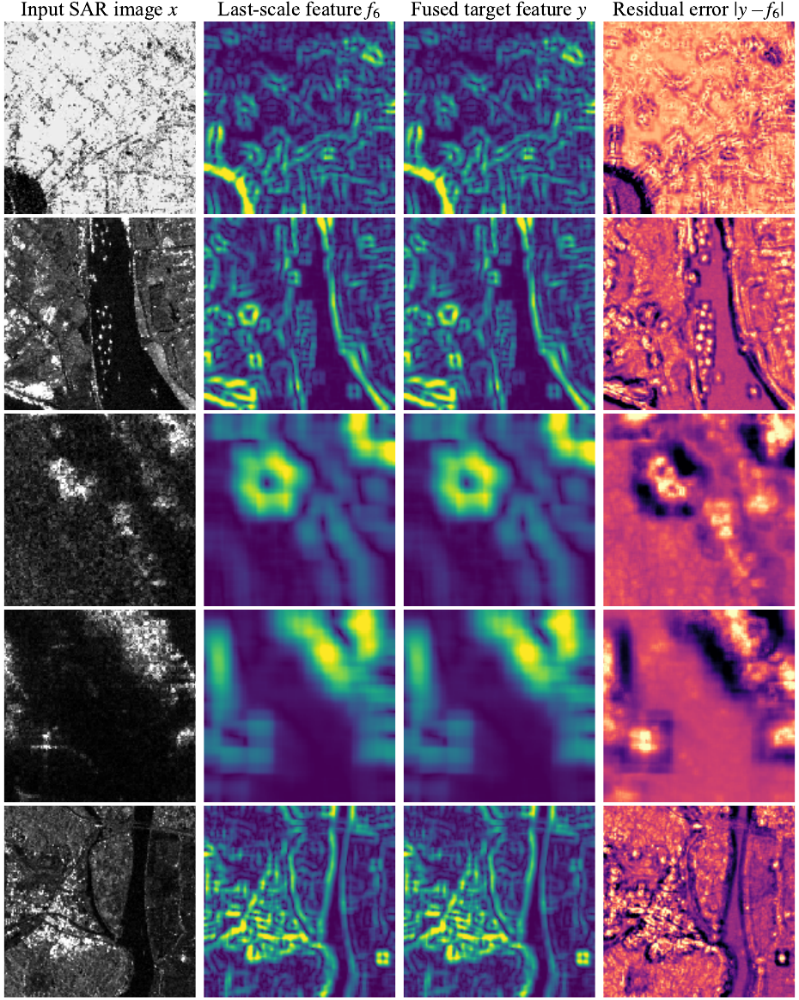
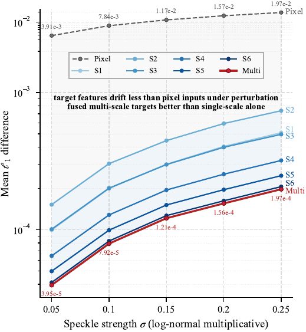

<div align="center">

# SARATR-X-v2

**Scale-Aware Structural Pre-Training for SAR Foundation Models**

<h5 align="center"><em> Weijie Li (李玮杰), Yafei Song, Yongxiang Liu (刘永祥), Bowen Peng, Jie Zhou, Jingyuan Xia, Wei Yang (杨威), Tianpeng Liu, Zhen Liu, and Li Liu (刘丽) </em></h5>

<p align="center">
  <a href="#Introduction">📖 Introduction</a> |
  <a href="#Pre-training">⚙️ Pre-training</a> |
  <a href="#Classification">📊 Classification</a> |
  <a href="#Detection">🎯 Detection</a> |
  <a href="#Segmentation">🧩 Segmentation</a> |
  <a href="#Statement">📜 Statement</a>
</p>

<p align="center">
  <a href="https://arxiv.org/abs/2607.23238"></a>
  <a href="https://github.com/waterdisappear/SARATR-X-v2"></a>
  <a href="https://github.com/waterdisappear/SARATR-X-v2/releases"></a>
</p>

<p align="center">
  
</p>

</div>

## Introduction / 简介

**EN** — SARATR-X-v2 is a vision foundation model for SAR target recognition, built upon **scale-aware structural masked pre-training**. Its core idea is a reconstruction target that is **robust to speckle noise** and **semantically consistent across scales**, enabling state-of-the-art transfer performance on classification, detection, and segmentation.

**中文** — SARATR-X-v2 是一个面向 SAR 目标识别的视觉基础模型，采用 **尺度感知结构掩码预训练（Scale-aware Structural Masked Pre-training）**。其核心是一套对 **相干斑噪声（speckle）稳健**、且跨尺度语义一致的重建目标，通过统一的预训练在分类、检测、分割三类下游任务上取得全面领先。

This repository provides a clean, well-commented, and executable implementation of *SARATR-X-v2*, including pre-training, linear / few-shot classification, rotated object detection, semantic segmentation, and paper-figure visualization.

本仓库提供 *SARATR-X-v2* 的清晰、易读、可执行的官方实现，涵盖预训练、线性 / 少样本分类、旋转目标检测、语义分割以及论文图表复现可视化。

<p align="center">
  
</p>

## Highlights / 方法亮点

- **Multi-scale structural target / 多尺度结构目标**：reconstruct a physical-prior target rather than raw pixels; 以 SAR 物理先验构造重建目标，而非直接重建像素。
  - Finest scale `S1` / 最细尺度 `S1`：**blind-spot averaging / 盲点平均**，3×3 kernel with zero center weight, insensitive to speckle; 3×3 核中心权重为 0，对斑点不敏感。
  - Larger scales `S2`–`S6` / 更大尺度 `S2`–`S6`：**log-ratio directional contrast / 对数比方向对比**，disjoint half-region kernels separate structure from speckle; 相邻半区互斥核分离结构与斑点。
- **Learnable cross-scale fusion / 可学习跨尺度融合**：softmax-constrained weights fuse multi-scale structural responses into a single scale-aware target; softmax 约束的融合权重将多尺度结构响应合成为单一尺度感知目标。
- **Speckle robustness / 斑点稳健性**：`S_multi < S_k < S_pixel`, the fused target is the most stable under coherent-imaging perturbation (see `visualize/`); 融合目标对相干成像扰动最稳定（见 `visualize/` 的稳定性实验）。
- **12 SAR benchmarks / 12 个 SAR 基准全面领先**：classification (ATRNet-STAR / MSTAR / SAR-VSA / FUSAR-Ship), detection (SARDet-100K / RSAR / SSDD / HRSID), segmentation (AIR-PolSAR-Seg-2.0 / OpenEarthMap-SAR / WHU-OPT-SAR / DDHR-SK); 分类（ATRNet-STAR / MSTAR / SAR-VSA / FUSAR-Ship）、检测（SARDet-100K / RSAR / SSDD / HRSID）、分割（AIR-PolSAR-Seg-2.0 / OpenEarthMap-SAR / WHU-OPT-SAR / DDHR-SK）。

## Repository Structure / 仓库结构

```
SARATR-X-v2/
├── pre-training/            # Pre-training (iTPN-FPN + multi-scale structural target) / 预训练（iTPN-FPN + 多尺度结构目标）
├── classification/          # Downstream classification: linear/k-NN + few-shot (Dassl) / 下游分类：线性/k-NN + 少样本
├── detection/               # Downstream detection: MMRotate custom extension / 下游检测：MMRotate 自定义扩展
├── segmentation/            # Downstream segmentation: MMSeg custom extension / 下游分割：MMSeg 自定义扩展
├── visualize/               # Paper-figure reproduction scripts / 论文图表复现脚本
├── dataset/                 # Dataset conventions & acquisition / 数据集说明与获取方式
├── weights/                 # Pre-trained weights (large files, uploaded separately) / 预训练权重（大文件，单独上传）
├── results/                 # Experiment results (large files; results/visualize committed) / 实验结果（大文件；results/visualize 随仓库提交）
└── docs/figures/            # Paper figures used in this README (PNG/PDF) / 论文图
```

## Pre-training / 预训练

**EN** — SARATR-X-v2 is pre-trained on **500K unlabeled SAR target chips** via scale-aware structural masked pre-training. The reconstruction target is constructed from six fixed structural extractors spanning different receptive fields and fused by learnable weights into one unified supervision signal. See `pre-training/` for details.

**中文** — SARATR-X-v2 在 **500K 张无标注 SAR 目标切片**上进行尺度感知结构掩码预训练。重建目标由六个覆盖不同感受野的固定结构算子构造，并通过可学习权重融合为统一的监督信号。详见 `pre-training/`。

| Target / 目标 | Description / 说明 |
|---|---|
| `pixel` | Raw-pixel reconstruction (baseline) / 原始像素重建（基线） |
| `single_s1` | S1: 3×3 blind-spot neighborhood aggregation (zero center) / 盲点邻域聚合 |
| `single_s2..s6` | S2~S6: log-ratio directional contrast, r = 3/5/9/13/17 / 对数比方向对比 |
| `multi` | **Main setting / 论文主设置**: softmax-constrained learnable multi-scale fusion / 可学习多尺度融合 |

```bash
cd pre-training
bash run_pretrain.sh                 # 8 GPUs / or / 或：
python main_pretrain.py --data_path <500K pre-training data> --output_dir <work_dir>
```

<p align="center">
  
</p>

## Classification / 分类

**EN** — Linear probing and k-NN / few-shot classification on SAR benchmarks with a frozen iTPN / HiViT backbone. See `classification/linear_eval/` and `classification/fewshot/`.

**中文** — 在 SAR 基准上对冻结的 iTPN / HiViT 骨干进行线性探测与 k-NN / 少样本分类评测。见 `classification/linear_eval/` 与 `classification/fewshot/`。

```bash
cd classification/linear_eval
export SARATRX_PRETRAIN_CKPT=/path/to/weights/base/jiaquan_simple/checkpoint-1200.pth
python SOC_50.py --data_root ../../dataset/classification/SOC_50classes
```

| Dataset / 数据集 | Method / 方法 | Paper result / 论文结果 |
| --- | --- | --- |
| ATRNet-STAR (SOC-50) | Linear probing, iTPN-B/L | 98.4 |
| MSTAR | Linear probing (few-shot) | 98.7 |
| SAR-VSA | Linear probing / k-NN | 90.8 |
| FUSAR-Ship | k-NN | 93.0 |

## Detection / 检测

**EN** — Rotated object detection on SAR benchmarks (RSAR, FAIR-CSAR, SARDet-100K, SSDD, HRSID) with ReDet / RoI Transformer / Oriented R-CNN + iTPN. The framework (mmrotate) is installed by the user; this repo provides the custom parts. See `detection/`.

**中文** — 在 SAR 基准（RSAR、FAIR-CSAR、SARDet-100K、SSDD、HRSID）上进行旋转目标检测，采用 ReDet / RoI Transformer / Oriented R-CNN + iTPN。框架（mmrotate）由用户自行安装，本仓库提供自定义部分。见 `detection/`。

```bash
# after copying detection/ into the mmrotate install / 将 detection/ 复制进 mmrotate 安装目录后：
bash tools/dist_train.sh configs/redet/redet_itpn_base_3x_rsar.py 4
bash tools/dist_test.sh configs/redet/redet_itpn_base_3x_rsar.py \
    work_dirs/redet_itpn_base_3x_rsar/latest.pth 4 --eval mAP
```

## Segmentation / 分割

**EN** — Semantic segmentation on SAR benchmarks (AIR-PolarSAR-Seg-2.0, OpenEarthMap-SAR, WHU-OPT-SAR, DDHR-SK) with UperNet + iTPN / HiViT. The framework (mmsegmentation) is installed by the user; this repo provides the custom parts. See `segmentation/`.

**中文** — 在 SAR 基准（AIR-PolarSAR-Seg-2.0、OpenEarthMap-SAR、WHU-OPT-SAR、DDHR-SK）上进行语义分割，采用 UperNet + iTPN / HiViT。框架（mmsegmentation）由用户自行安装，本仓库提供自定义部分。见 `segmentation/`。

```bash
bash tools/dist_train.sh \
    configs/itpn/pixel_upernet_itpn_base_12_512_slide_160k_air_polarsar2_amp_linux.py 8
```

## Results / 实验结果

**EN** — SARATR-X-v2 achieves state-of-the-art transfer performance on **12 SAR benchmarks** across classification, detection, and segmentation. See `results/` for the layout and `visualize/` for figure-reproduction scripts.

**中文** — SARATR-X-v2 在覆盖分类、检测、分割的 **12 个 SAR 基准**上取得全面领先的迁移性能。结果目录布局见 `results/`，图表复现脚本见 `visualize/`。

<p align="center">
  
</p>

Under synthetic speckle variation, the proposed target reduces perturbation drift in the learned representation by **nearly two orders of magnitude** relative to pixel-space supervision.

在合成斑点扰动下，所提目标将学习表示的扰动漂移相对像素空间监督降低了**近两个数量级**。

<p align="center">
  
  
</p>

## Data / 数据

**EN** — See `dataset/README.md` for directory conventions and how to obtain the datasets.

**中文** — 数据集的目录约定与获取方式见 `dataset/README.md`。主要数据集：

- **Pre-training / 预训练**：FAIR-CSAR large-scale SAR images (500K) / 大规模 SAR 影像（500K 张）
- **Classification / 分类**：SOC-50 / SAR-VSA / FUSAR-Ship / ATRNet-STAR / MSTAR
- **Detection / 检测**：RSAR / FAIR-CSAR / SARDet-100K / SSDD / HRSID / DOTA
- **Segmentation / 分割**：AIR-PolarSAR-Seg-2.0 / OpenEarthMap-SAR / WHU-OPT-SAR / DDHR-SK

## Weights & Results / 权重与结果

**EN** — Pre-trained weights and experiment results are large and **not committed**; download them from the release and place them per the READMEs. `results/visualize/` csv/json (small) are committed for figure reproduction.

**中文** — 预训练权重与实验结果文件较大，**不随仓库提交**；请从 release 附件获取后按 README 放置。`results/visualize/` 下的实验数据（csv/json，体积小）已随仓库提交，可直接复现论文图表。

- `weights/README.md`：pre-trained weight layout (iTPN-B/L × fusion targets/ablations) and mapping to downstream tasks; `checkpoint-1200.pth` by default; 预训练权重目录结构与下游任务对应关系，默认使用 `checkpoint-1200.pth`。
- `results/README.md`：downstream result layout; 下游实验结果目录结构。

## Statement / 声明

### Citation / 引用

```bibtex
@article{saratrxv2,
  title={SARATR-X-v2: Scale-Aware Structural Pre-Training for SAR Foundation Models},
  author={Li, Weijie and Song, Yafei and Liu, Yongxiang and Peng, Bowen and Zhou, Jie and
          Xia, Jingyuan and Yang, Wei and Liu, Tianpeng and Liu, Zhen and Liu, Li},
  journal={IEEE Geoscience and Remote Sensing Magazine},
  year={2026},
  eprint={2607.23238},
  archivePrefix={arXiv},
  primaryClass={cs.CV}
}
```

Paper: [arXiv:2607.23238](https://arxiv.org/abs/2607.23238) / 论文链接：[arXiv:2607.23238](https://arxiv.org/abs/2607.23238)

### Acknowledgement / 致谢

This implementation references the following open-source projects: iTPN, HiViT, Dassl (CoOp/CoCoOp), MMRotate, MMSegmentation, mmcv, timm.

本实现参考了以下开源项目：iTPN、HiViT、Dassl (CoOp/CoCoOp)、MMRotate、MMSegmentation、mmcv、timm。

### License / 许可证

This repository is released under the MIT License (see `LICENSE`). 本仓库代码以 MIT License 发布（详见 `LICENSE`）。
